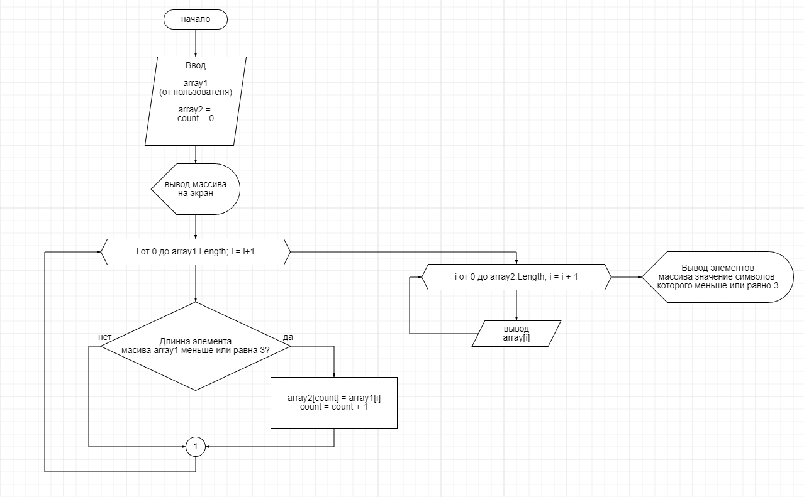

# Control Work #

## Задача ##

```
Написать программу, которая из имеющегося массива строк формирует массив из строк, 
длина которых меньше либо равна 3 символа. Первоначальный массив можно ввести с клавиатуры,
либо задать на стартевыполнения алгоритма. При решении не рекомендуется пользоваться коллекциями,
лучше обойтись исключительно массивами.
```
## Блок схема ##



## Создание ногово репозитория для задачи ##

1. *git init* - инициализация локальной базы контроля версий

2. *git add* - добавление элементов в базу 

3. *git commit -m* -  сохранение изменений в базе с коментарием 

4. *git push (ссылка на гитхаб)* - загрузка в удаленный репозиторий 

## Решение задачи ##

1. Ввод однострочного массива с типом данных string от пользователя

2. Ввод доп массива для записи всех значений длинна которых меньше либо равна 3-м

3. Создаем счетчик который будет перебирать значение первого массива веденного 
пользователем
4. Через цикл for узнаем длинну массива веденного пользователем. внутри цикла 
используем if, чтобы узнать длинну значений в массиве и проверяем его на условие задачи меньше или равно 3-м

5. записываем все значения удовлетворяющие условию в новый массив

6. вывод массива

> Дата создания файла : 06.09.2022  19:50